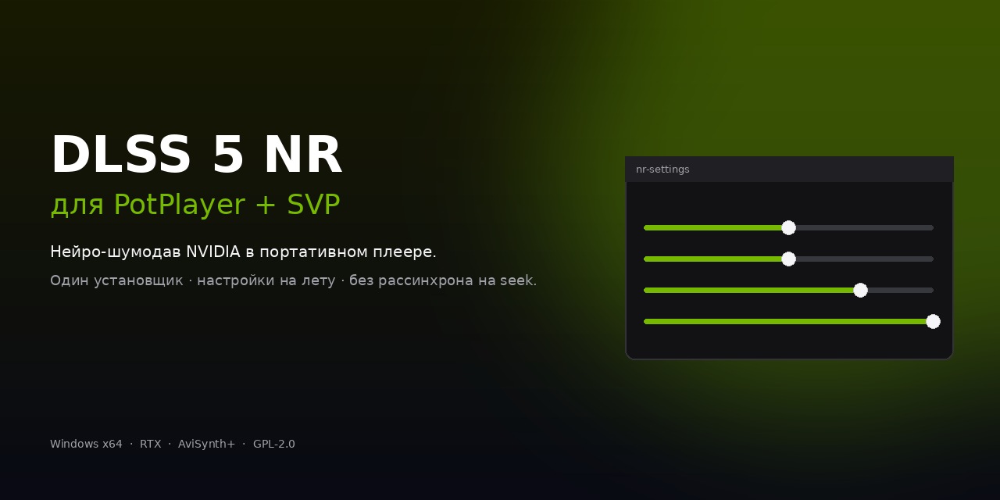
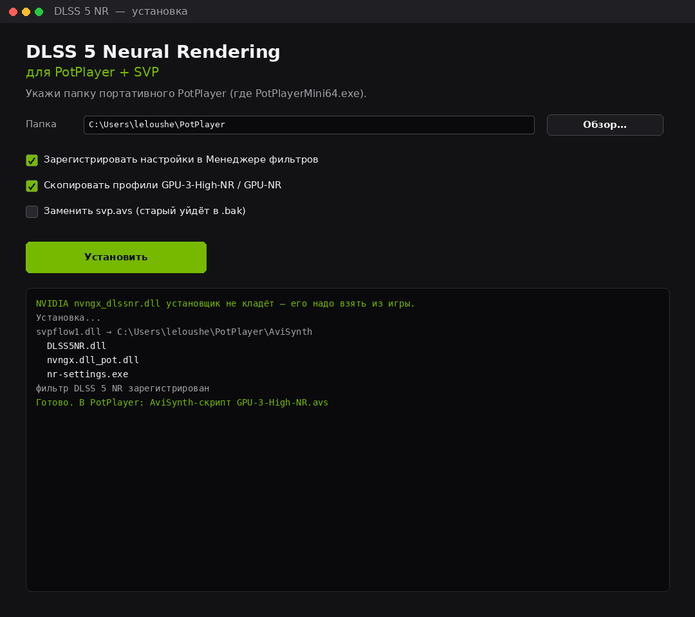
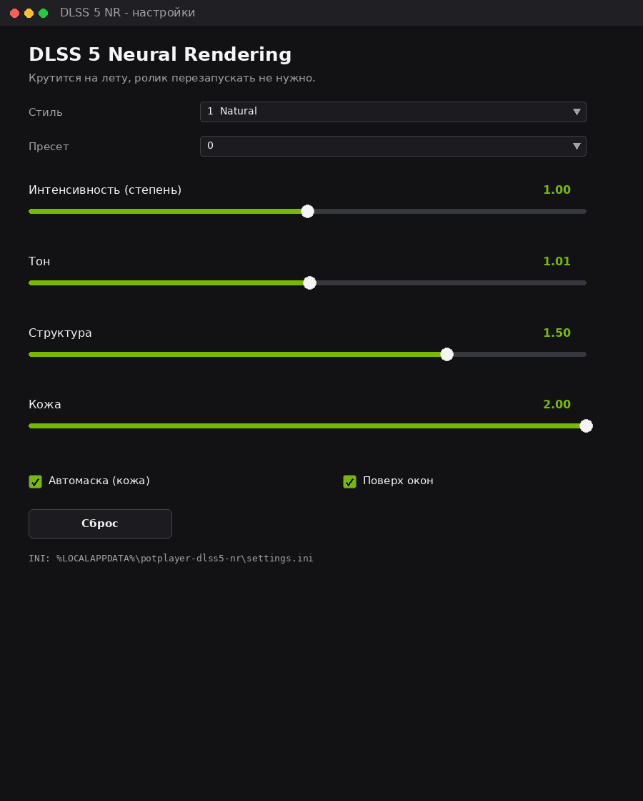
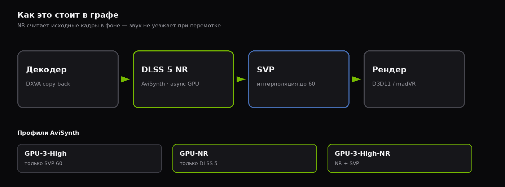

<p align="center">
  
</p>

<p align="center">
  <a href="https://github.com/zeroleloushe/potplayer-dlss5-nr/releases/latest"></a>
  
  
  
</p>

**DLSS 5 Neural Rendering** (NGX feature 18) как плагин AviSynth+ / VapourSynth для портативного **PotPlayer + SVP**.

Неофициально. Не NVIDIA, не Daum, не SVP. Только Windows x64 и видеокарта RTX.

- Шумодав считается **на исходных кадрах**, SVP интерполирует уже чистую картинку.
- NR в **фоновом потоке** — перемотка не вешает видео и не уводит звук.
- Слайдеры (степень, тон, структура, кожа) крутятся **на лету**, ролик перезапускать не нужно.
- Один `DLSS5-NR-Setup.exe`: указал папку PotPlayer — установил.

---

## Скачать

**[Latest release →](https://github.com/zeroleloushe/potplayer-dlss5-nr/releases/latest)**

Нужен один файл: [`DLSS5-NR-Setup.exe`](https://github.com/zeroleloushe/potplayer-dlss5-nr/releases/latest).

NVIDIA `nvngx_dlssnr.dll` (~158 МБ) **в установщик не входит**. Его нужно взять из игры с DLSS 5 NR (часто NBA 2K27) и положить в `%LOCALAPPDATA%\potplayer-dlss5-nr\runtime\`. Драйвер **616.56+**.

---

## Скриншоты

<p align="center">
  
  &nbsp;
  
</p>

<p align="center">
  
</p>

---

## Установка за 2 минуты

1. **Закрой PotPlayer** полностью (и SVP, если висит в трее).
2. Запусти `DLSS5-NR-Setup.exe`.
3. Папка — там, где `PotPlayerMini64.exe` (у портативки часто `C:\Users\<ты>\PotPlayer`).
4. Галочки:
   - **Зарегистрировать настройки** — да
   - **Скопировать профили** — да
   - **Заменить svp.avs** — **нет**, если у тебя уже рабочий скрипт SVP
5. **Установить**. Если `nvngx_dlssnr.dll` ещё нет — откроется папка `runtime`, кинь туда файл из игры.
6. В PotPlayer выбери AviSynth-скрипт:
   - `GPU-3-High-NR.avs` — NR + SVP до 60
   - `GPU-NR.avs` — только NR
   - свой старый `GPU-3-High.avs` — только SVP

Настройки эффекта: **F5 → Фильтры → Менеджер фильтров → DLSS 5 NR** (двойной клик). Либо `nr-settings.exe` в папке плеера.

### Что должен сделать установщик

| Файл | Куда |
|---|---|
| `DLSS5NR.dll`, `nvngx.dll_pot.dll` | рядом с `svpflow1.dll` |
| `nr-potfilter.dll`, `nr-settings.exe` | корень PotPlayer |
| `GPU-3-High-NR.avs`, `GPU-NR.avs` | папка AviSynth-скриптов |
| `nvngx_dlssnr.dll` *(ты сам)* | `%LOCALAPPDATA%\potplayer-dlss5-nr\runtime\` |

Имя шима **`nvngx.dll_pot.dll` менять нельзя** — runtime проверяет, что в пути вызывающего есть `nvngx.dll` (`0xBAD00002`).

---

## Профили

В `svp.avs` два флага:

```avs
nr=1        # 0 выкл / 1 DLSS 5 NR
smooth=1    # 0 без интерполяции / 1 SVP до fps=
```

| Скрипт | NR | SVP 60 |
|---|:-:|:-:|
| `GPU-3-High.avs` | | ✓ |
| `GPU-NR.avs` | ✓ | |
| `GPU-3-High-NR.avs` | ✓ | ✓ |

4K + NR + SVP тяжело. Для 4K лучше `GPU-NR` или чистый `GPU-3-High`.

---

## Настройки на лету

Пишутся в `%LOCALAPPDATA%\potplayer-dlss5-nr\settings.ini`, плагин подхватывает на следующем кадре.

| Параметр | По умолчанию | Смысл |
|---|---|---|
| style | 1 Natural | 0 default / 1 natural / 2 cinematic |
| intensity | 1.0 | сила эффекта, 0…2 |
| tone | 1.0 | локальный тон |
| structure | 1.5 | структура |
| skin | 2.0 | кожа (с автомаской) |
| automask | on | автомаска кожи |

Не включай в PotPlayer **D3D11 GPU Super Resolution** — это RTX VSR, другой фильтр, с NR они дерутся.

Рендер: встроенный Direct3D 11 или madVR. DXVA copy-back должен быть включён (NR работает с CPU-staged BGRA).

---

## Если что-то не так

| Симптом | Что проверить |
|---|---|
| `There is no function named DLSS5NR` | `DLSS5NR.dll` не рядом с `svpflow1.dll`, или нет `LoadPlugin` |
| Access Violation на строке скрипта | старый порядок Prefetch; возьми `svp.avs` из релиза или не ставь NR *после* Prefetch(7) |
| Картинка не меняется | нет `nvngx_dlssnr.dll` в runtime, или выключен `nr=1` |
| `0xBAD00002` | шим переименован / не лежит рядом с плагином |
| `0xBAD00001` | этот билд NR runtime не для твоей карты |
| Тормоза на 4K | профиль без SVP, или NR выключить |
| Рассинхрон на перемотке | нужна `DLSS5NR.dll` **v0.1.8+** (async worker) |

Лог: `%LOCALAPPDATA%\potplayer-dlss5-nr\nr.log`.

---

## Сборка из исходников

VS 2022 x64 + CMake 3.28+:

```bat
build.bat
```

Или:

```bat
cmake -S . -B build -G "NMake Makefiles" -DCMAKE_BUILD_TYPE=Release
cmake --build build
```

Артефакты: `DLSS5NR.dll`, `vsdlss5nr.dll`, `nvngx.dll_pot.dll`, `nr-settings.exe`, `nr-potfilter.dll`, `DLSS5-NR-Setup.exe`.

## VapourSynth (SVP RIFE)

```python
clip = core.resize.Bicubic(clip, format=vs.RGB24, matrix_in_s="709")
clip = core.dlss5.NR(clip, style=1, intensity=1.0, structure=1.5, skin=2.0, automask=1)
clip = core.resize.Bicubic(clip, format=vs.YUV420P8, matrix_s="709")
```

`vsdlss5nr.dll` + `nvngx.dll_pot.dll` в папку плагинов VS. SVP → Utilities → Set environment variables for VapourSynth, перезапуск PotPlayer.

## Ограничения

- Векторов движения от SVP пока нет. На резких панорамах может смазывать — как OBS-плагин.
- 8-bit BGRA, HDR/10-bit не подключены.
- 1080p — комфортная цель. 4K60 + NR + SVP упирается в GPU.
- RTX 50 проверен сообществом на runtime 310.8; 40/30/20 — «как повезёт».
- Frame Generation вне скоупа.

Порт моста с [obs-dlss5-nr](https://github.com/Saganaki22/obs-dlss5-nr).

## License

GPL-2.0. См. [LICENSE](LICENSE) и [THIRD_PARTY_NOTICES.md](THIRD_PARTY_NOTICES.md).

---

<details>
<summary>English</summary>

Unofficial **DLSS 5 Neural Rendering** plugin for a portable **PotPlayer + SVP** stack (AviSynth+ / VapourSynth). Windows x64 + RTX only.

Grab [`DLSS5-NR-Setup.exe`](https://github.com/zeroleloushe/potplayer-dlss5-nr/releases/latest), point it at your PotPlayer folder, close the player first. You must supply NVIDIA’s `nvngx_dlssnr.dll` yourself into `%LOCALAPPDATA%\potplayer-dlss5-nr\runtime\`. Do not rename `nvngx.dll_pot.dll`. Live sliders live under PotPlayer **F5 → Filter Management → DLSS 5 NR**. Use profile `GPU-3-High-NR.avs` for NR+SVP, `GPU-NR.avs` for NR only.

</details>
